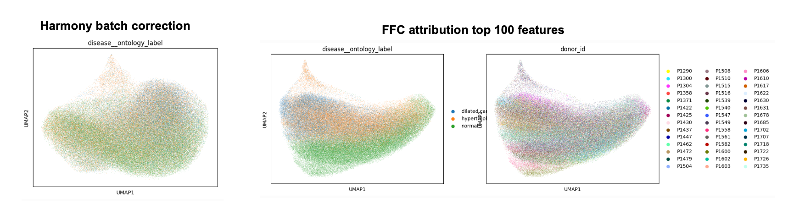
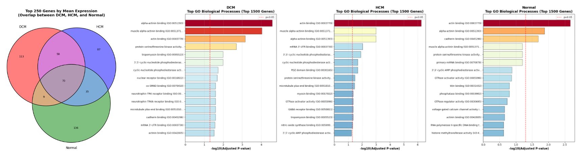
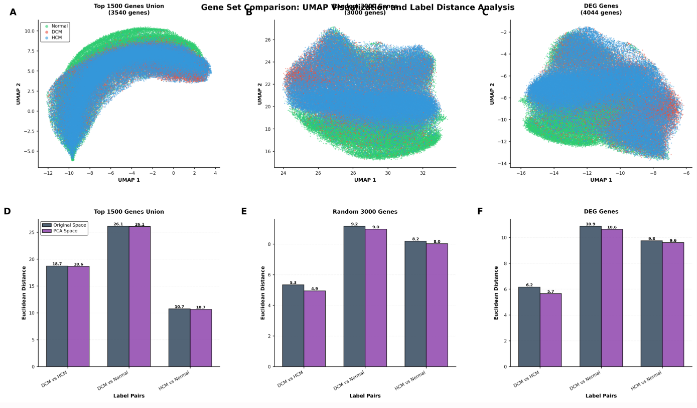
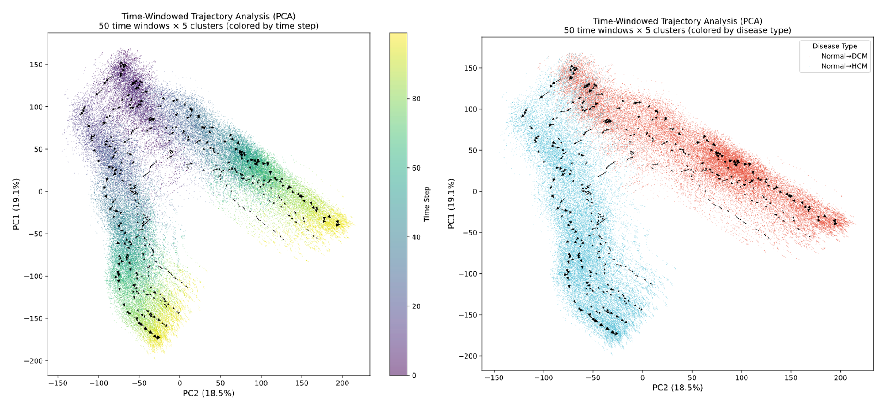

# FreqTrack
This project explores the integration of single-cell multi-omics data with deep learning models to learn biologically meaningful representations across molecular modalities.
By jointly modeling modalities such as snRNA-seq and snATAC-seq, the framework aims to capture shared and modality-specific features that enable robust cell-type characterization and downstream interpretability analyses.

## Main Ideas
The project focuses on:
1. Unified modeling of heterogeneous single-cell modalities
2. Representation learning across frequency / latent dimensions
3. Sensitivity- and attribution-based analysis for biological interpretation

## Main Goals
1. Batch Correction/Data Integration
2. DEG/Marker Gene Searching
3. Trajectory Analysis

This repository contains the core modeling code, analysis pipelines, and example workflows used in this study.

## Preliminary Results
Our methods achieves batch correction

Our methods achieves finding disease-related genes

Our methods achieves better distinguish for diseases comparing using traditional DEGs

Our methods achieves Trajectory Analysis for those similar cells that cannot perform trajectory analysis using traditional methods

## Updates
(01/21/2026) We have achieved the main goals and expanding this project.
